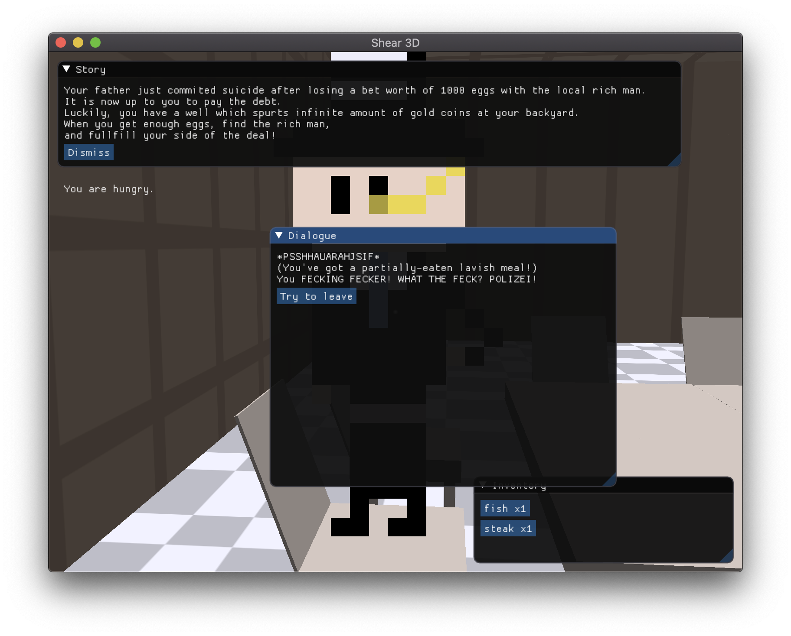

## Shear 3D

__WARNING: slight swears are present in this game!__



(See, this is what happens when you punch the rich man in the face when he's eating!)

Shear 3D is  the remake of ShearGame, a game which I made long before. It's like the first game I've ever made. It utilizes ImGui!

And now because of the incoming 7DRL practicing and other reasons, I am remaking it out of nostalgia, or whatever reasons. Play it at your own risk!

## Building 

Well, we can't expect everybody to use Xcode, right? It sucks! So we use CMake from now on. To compile this project, all you need is:

```sh
mkdir build && cd build
cmake ..
make
```

Then you can

```sh
cd Shear3D
./Shear3D
```

and start playing!

__NOTE__: As I am using relative path to load files, (at least) in macOS this is the only way to launch Shear3D. You cannot double click on it, because in this way it won't be able to load other files. So yeah! `./Shear3D` only! Also you might need to codesign the executable.

## The story

Your father just commited suicide after losing a bet worth of 1000 eggs with the local rich man. It is now up to you to pay the debt. Luckily, you have a well which spurts infinite amount of gold coins at your backyard. When you get enough eggs, find the rich man, and fullfill your side of the deal!

## Meet other people

There are all sorts of people in the Shear Village, all of  them have their daily lives going on!

## Grind the money

The well has a buttload of money in it. So make full use of it! However, the rich man does not seek money. He seeks eggs...

## Romance! (maybe)

See a girl you like? Flirt with her! I might implement that one day.

## Alright, I've been playing it for a while now, but I've absolutely no idea what I am playing

Look, the place you first spawn is your home, and in your backyard there's a well which has infinite coins. Use the right mouse button to interact with all sorts of objects, chests, trees, wells, peoples, etc. If you are getting money from the well, you better be quick, as time passes quickly in the well. With those money you can go to the steak store, which is the first house on your left after you leave your house. And you can go to the square to buy eggs. Stand on the bed to sleep and restore your stamina.

When you've collected 1000 eggs, talk to the rich man in the house (who obviously has a very large mansion) during his office hours. And then you will win the game!
